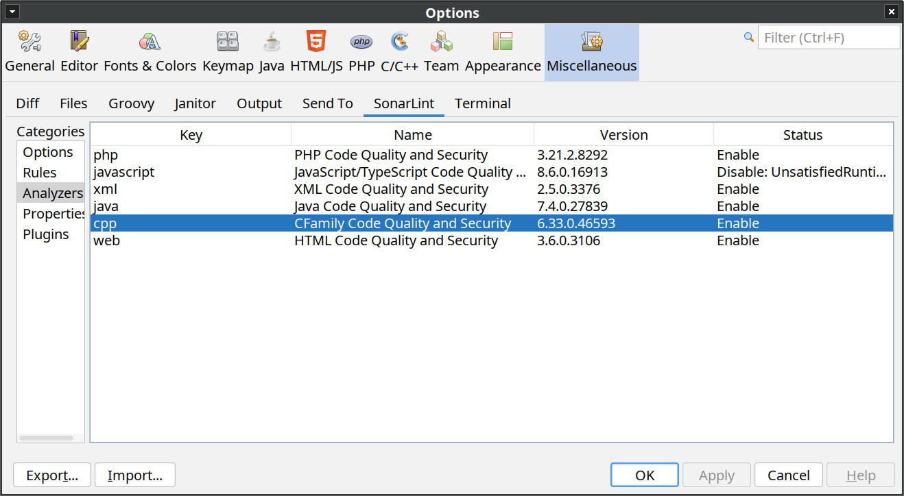
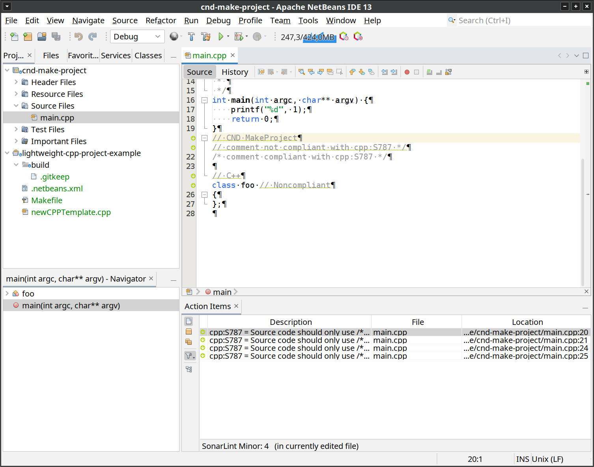
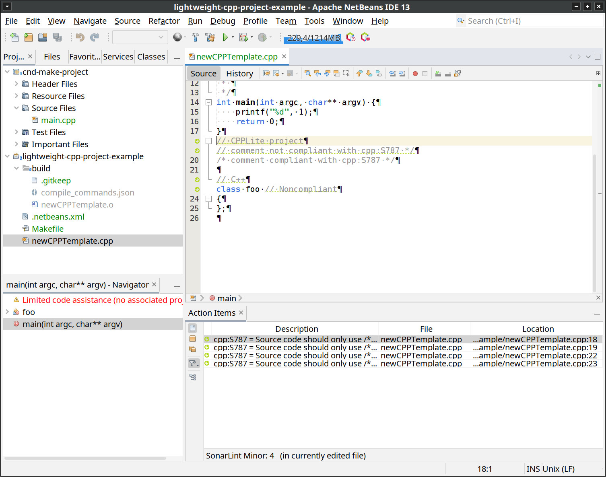

:toc:
:toclevels: 5

= Analyse des fichiers pour C/C++

== Introduction

The analysis of C/C++ files can be done using the SonarQube plugin `CFamily`. +
The `CFamily` plugin is not open source and is only available in the Developer Edition of SonarQube. +
As a reminder, this SonarLint integration is not an official plugin supported by SonarSource and the use of non-open source or licensed plugins is the responsibility of the user. +
However, using the plugin is possible, but adding it to the SonarLint integration with Netbeans requires manual actions. +

== Installation

The `CFamily` plugin is distributed by SonarSource in the official SonarLint plugins. +
So, once you get the `CFamily` plugin from SonarQube or an official SonarLint plugin, you can add it in `Tools -> Options -> Miscelaneous -> SonarLint -> Plugins`. +

Once added, it must be visible in the "Analyzer" section. +

.Example with CFamily plugin in "Analyzer"

== Configuration

The configuration of the `CFamily` plugin is explained in the SonarQube documentation: https://docs.sonarqube.org/latest/analysis/languages/cfamily/ +
To summarize, there are two ways to configure the plugin:

* SonarSource Build Wrapper, ising the `sonar.cfamily.build-wrapper-output` property and a tool developed by SonarSource.
* Compilation Database, using the `sonar.cfamily.compile-commands` property

In all cases, the properties must be set either globally (`Tools -> Options -> Miscelaneous -> SonarLint -> Properties`),
or in the project if the project type allows it (`SonarLint -> Properties`). +

.Compilation Database
[TIP]
====
The project https://github.com/nickdiego/compiledb[compiledb] allows to generate the file used by
`sonar.cfamily.compile-commands` for "GNU make-based build systems".
====

.Project path in the properties
[TIP]
====
Properties can contain `${projectDir}` which will be replaced by the project path when using these properties.
====

== Different types of C/C++ projects managed by Netbeans

=== CPPLiteProject / "lightweight C/C++ project"

CPPLite, also called "lightweight C/C++ project", is a type of project that associates Netbeans actions (Build, Clean, ...) to commands that are to be configured. +
This type of project can benefit from customization with SonarLint, which means that the rules and properties of SonarLint can also be customized. +

[NOTE]
====
Since this type of project is free in the commands used, it may as well use `GNU Make` as build tool.
====

=== MakeProject / CND

Projects of type `MakeProject`, also known as `CND`, cannot have per-project configuration, as it uses its own solution to display a project's panel and therefore does not use `ProjectCustomizer.createCustomizerDialog`. +
This type of project cannot benefit from customization and therefore only SonarLint global rules and properties will be applied to it. +

Here are the classes identified that show the solution chosen for customizing this type of project:

- https://github.com/apache/netbeans/blob/cnd/cnd/cnd.makeproject/src/org/netbeans/modules/cnd/makeproject/MakeProjectImpl.java
- https://github.com/apache/netbeans/blob/cnd/cnd/cnd.makeproject.ui/src/org/netbeans/modules/cnd/makeproject/ui/MakeCustomizerProviderImpl.java
- https://github.com/apache/netbeans/blob/cnd/cnd/cnd.makeproject.ui/src/org/netbeans/modules/cnd/makeproject/ui/customizer/ProjectNodeFactory.java
- https://github.com/apache/netbeans/blob/cnd/cnd/cnd.makeproject.ui/src/org/netbeans/modules/cnd/makeproject/ui/customizer/MakeCustomizer.java

[NOTE]
====
Any participation is welcome to better understand or to add a customization to this type of project :)
====

== Screenshots

.CFamily analyzer

.CND MakeProject example

.CPPLite Project example

