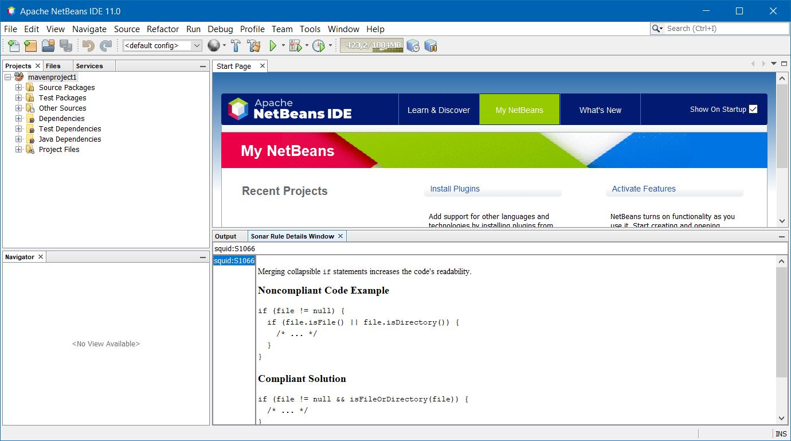

= sonarlint4netbeans

== SonarLint integration for Apache Netbeans

Features:

- Support Java and Javascript
- Annotation in editor
- Type SonarLint in Action Items
- Enable/Disable Rules in Tools/Options/Miscellaneous/SonarLint

== Screenshot

.SonarLint in Java editor and show action items for selected project
image::docs/JavaEditorAnnotationAndActionItems.jpg[]

.Show Action Items fo currently edited file only
image::docs/JavascriptActionItems.jpg[]

.SonarLint analyzer name and version
image::docs/OptionsSonarLintAnalyzers.jpg[]

.SonarLint rules enabled or disabled
image::docs/OptionsSonarLintRules.jpg[]

.Sonar rule details window
