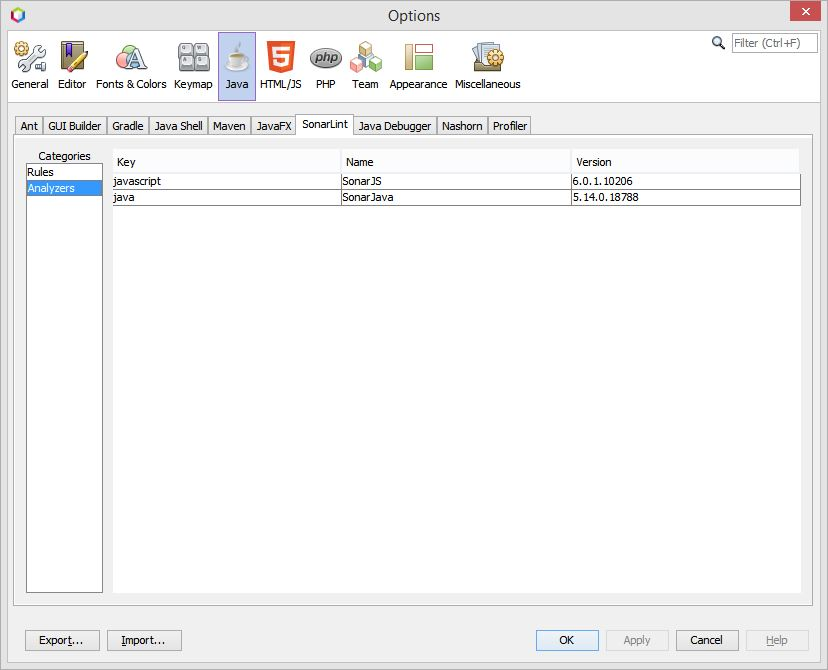

= sonarlint4netbeans

== SonarLint integration for Apache Netbeans

Features:

- SonarLint for Java in editor and Action Item
- SonarLint for Javascript in Action Item
- Enable/Disable rules in Options/Java/SonarLint

== Screenshot

.SonarLint in Java editor and show action items for selected project
image::docs/JavaEditorAnnotationAndActionItems.jpg[]

.Show Action Items fo currently edited file only
image::docs/JavascriptActionItems.jpg[]

.SonarLint analyzer name and version

.SonarLint rules enabled or disabled
image::docs/OptionsJavaSonarLintRules.jpg[]

.Sonar rule details window
image::docs/SonarRuleDetailsWindow.jpg[]