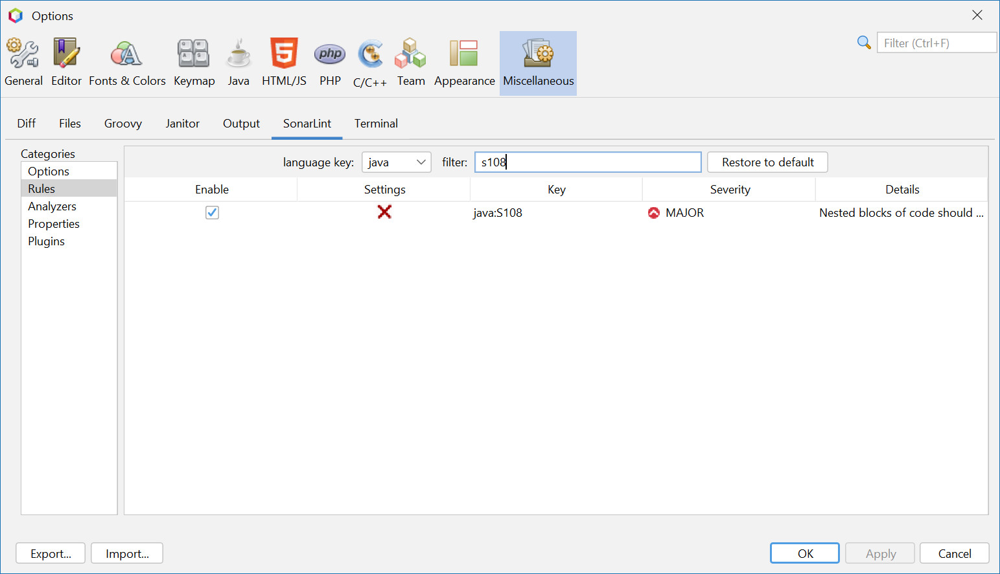
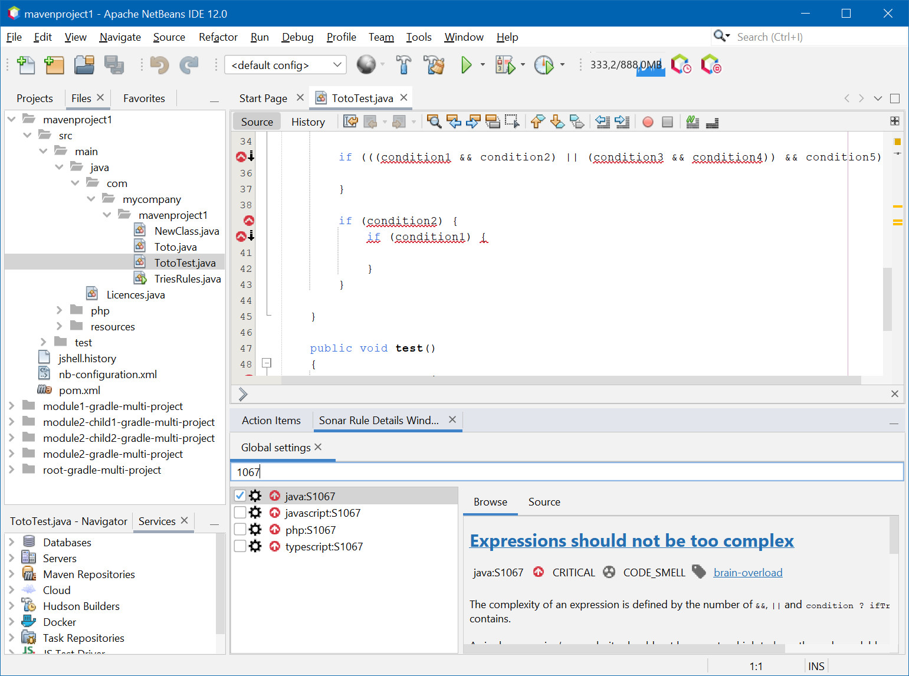
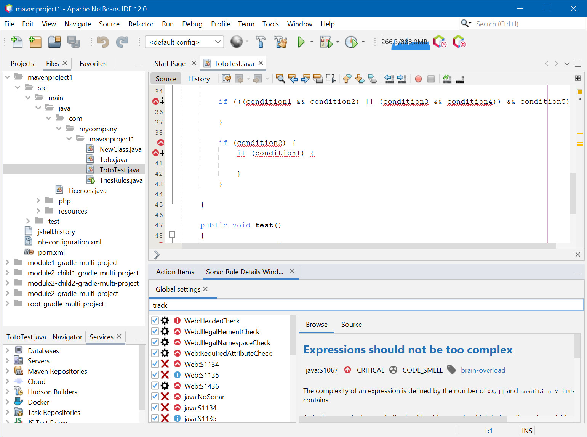

:toc:
:toclevels: 5

= sonarlint4netbeans

== SonarLint integration for Apache Netbeans

Features:

- Support Java and Javascript
- Annotation in editor
- Type SonarLint in Action Items
- Enable/Disable Rules in Tools/Options/Miscellaneous/SonarLint
- Filter Rules in Tools/Options/Miscellaneous/SonarLint option panel and "Sonar Rule Details" window
- Severity icons

== Release 1.x to 2.x

Release 2.0.0 want publish this plugin in new Netbeans portal based on Maven central repository. +
For this, all package are renamed and have

=== Preferences

In Netbeans `User dirrectory` move `config/Preferences/fr/philippefichet/sonarlint/netbeans.properties` to `config/Preferences/com/github/philippefichet/sonarlint4netbeans/netbeans.properties`. +

You can found Netbeans `User dirrectory` in menu `Help/About`. +

== Screenshot

.SonarLint in Java editor and show action items for selected project

.Show Action Items fo currently edited file only
image::docs/JavascriptActionItems.jpg[]

.SonarLint analyzer name and version
image::docs/OptionsSonarLintAnalyzers.jpg[]

.SonarLint rules enabled or disabled
image::docs/OptionsSonarLintRules.jpg[]

.SonarLint rules enabled or disabled with key filter

.SonarLint rules enabled or disabled with name filter
image::docs/OptionsSonarLintRulesWithNameFilter.jpg[]

.Sonar rule details window with key filter

.Sonar rule details window with name filter
