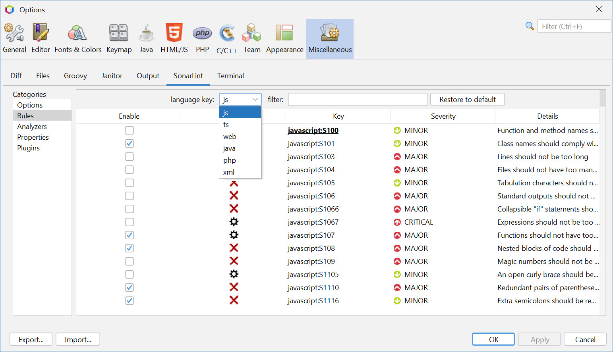

= sonarlint4netbeans

== SonarLint integration for Apache Netbeans

Features:

- Support Java and Javascript
- Annotation in editor
- Type SonarLint in Action Items
- Enable/Disable Rules in Tools/Options/Miscellaneous/SonarLint
- Filter Rules in Tools/Options/Miscellaneous/SonarLint option panel and "Sonar Rule Details" window
- Severity icons

== Screenshot

.SonarLint in Java editor and show action items for selected project
image::docs/JavaEditorAnnotationAndActionItems.jpg[]

.Show Action Items fo currently edited file only
image::docs/JavascriptActionItems.jpg[]

.SonarLint analyzer name and version
image::docs/OptionsSonarLintAnalyzers.jpg[]

.SonarLint rules enabled or disabled

.SonarLint rules enabled or disabled with key filter
image::docs/OptionsSonarLintRulesWithKeyFilter.jpg[]

.SonarLint rules enabled or disabled with name filter
image::docs/OptionsSonarLintRulesWithNameFilter.jpg[]

.Sonar rule details window with key filter
image::docs/SonarRuleDetailsWindowWithKeyFilter.jpg[]

.Sonar rule details window with name filter
image::docs/SonarRuleDetailsWindowWithNameFilter.jpg[]