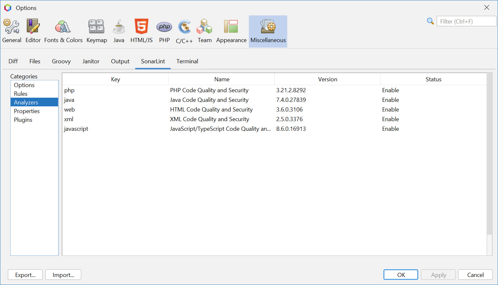
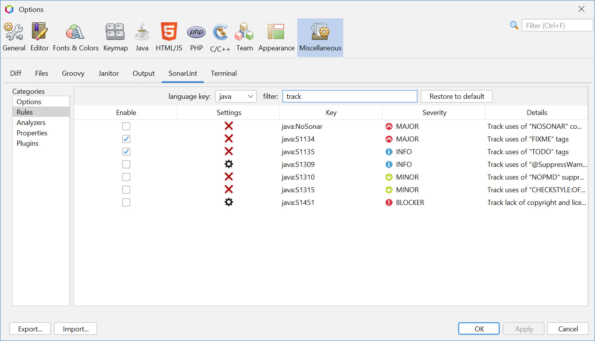
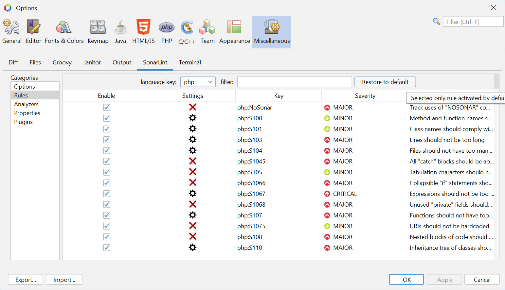
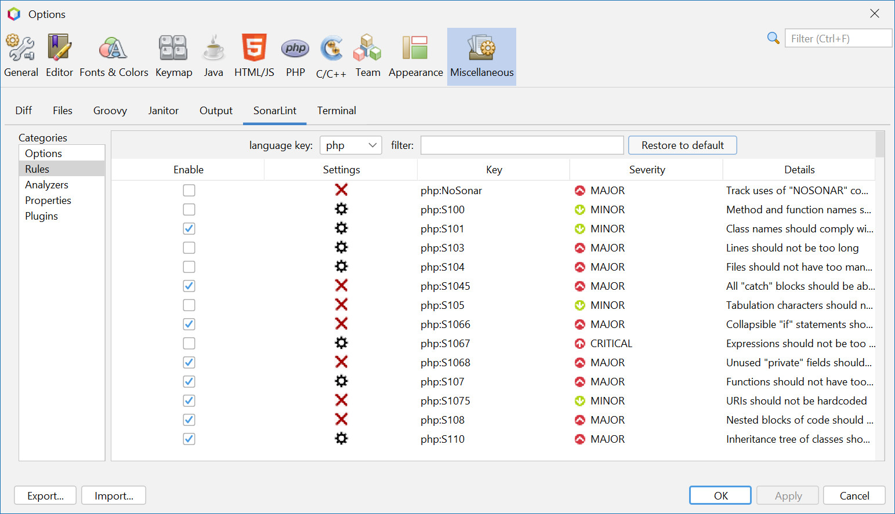
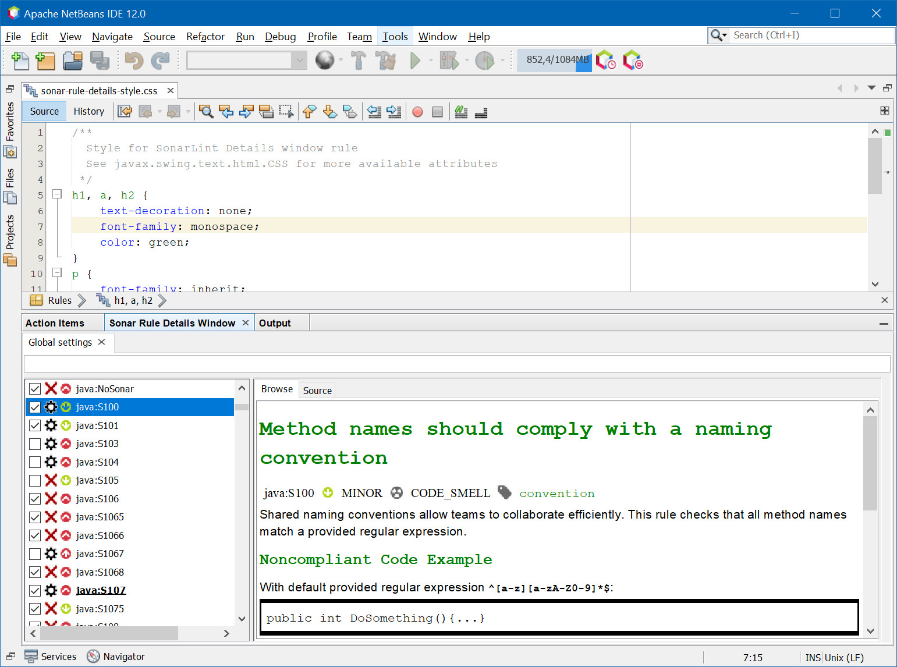
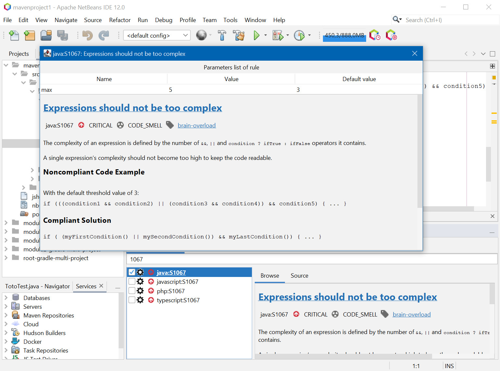

:toc:
:toclevels: 5

= sonarlint4netbeans

== SonarLint integration for Apache Netbeans

Features:

- Support Java, Javascript, PHP, HTML and XML
- Annotation in editor
- Type SonarLint in Action Items
- "Analyze with SonarLint" action on Project/package/files, Favorites tab, ...
- Enable/Disable Rules in Tools/Options/Miscellaneous/SonarLint
- Filter Rules in Tools/Options/Miscellaneous/SonarLint option panel and "Sonar Rule Details" window
- Change rule settings in Tools/Options/Miscellaneous/SonarLint or in "Sonar Rule Details" window
- Restore selected rule from activated by default
- Custom "Sonar Rule Details" window with CSS
- Enable or disabled test rules on test files
- Severity icons

== Release 1.x to 2.x

Release 2.0.0 want publish this plugin in new Netbeans portal based on Maven central repository. +
For this, all package are renamed and have

=== Preferences

In Netbeans `User dirrectory` move `config/Preferences/fr/philippefichet/sonarlint/netbeans.properties` to `config/Preferences/com/github/philippefichet/sonarlint4netbeans/netbeans.properties`. +

You can found Netbeans `User dirrectory` in menu `Help/About`. +

== "Analyze with SonarLint"

You can run an "Analyze with SonarLint by context menu (click right) on project, folder, many file, ... +
This action is visible directly in context menu on through `Tools` sub menu. +

.Analyze with SonarLint on project

.Analyze with SonarLint in Favorites tab

== Rule settings

You can change rule settings by left click on this icon image:docs/icon-settings.png[] in Tools/Options/Miscellaneous/SonarLint or in "Sonar Rule Details" window. +

When a rule has no settings, this icon image:docs/icon-settings-empty.png[] is present. +

.Sonar rule details window with name filter
image::docs/SonarRuleDetailsWindowWithNameFilter.jpg[]

== "Sonar rule details" window StyleSheet

You can customize "Sonar rule details" with CSS. +

Go to Tools/Options/Miscellaneous/SonarLint and click on "Options" and on button "Edit stylesheet for sonar rule detail window". +

[IMPORTANT] 
====
CSS is limited by https://docs.oracle.com/javase/8/docs/api/javax/swing/text/html/CSS.html[javax.swing.text.html.CSS], 
consult the documentation to know the supported properties.
====

== Screenshot

.SonarLint in Java editor and show action items for selected project
image::docs/JavaEditorAnnotationAndActionItems.jpg[]

.Show Action Items fo currently edited file only
image::docs/JavascriptActionItems.jpg[]

.Analyze with SonarLint on project

.Analyze with SonarLint in Favorites tab

.SonarLint analyzer name and version

.SonarLint rules enabled or disabled
image::docs/OptionsSonarLintRules.jpg[]

.SonarLint rules enabled or disabled with key filter
image::docs/OptionsSonarLintRulesWithKeyFilter.jpg[]

.SonarLint rules enabled or disabled with name filter

.Restore selected rule from activated by default (before)

.Restore selected rule from activated by default (after)

.SonarLint Options
image::docs/OptionsSonarLintOptions

.Sonar rule details window with key filter
image::docs/SonarRuleDetailsWindowWithKeyFilter.jpg[]

.Sonar rule details window with name filter
image::docs/SonarRuleDetailsWindowWithNameFilter.jpg[]

.Sonar rule details window with custom style

.Sonar rule details window without change settings on java:S1067 rule
image::docs/SonarRuleDetailsWithSettingsNoChangeJavaS1067.jpg[]

.Sonar rule details window with change to "5" the "max" settings on java:S1067 rule
